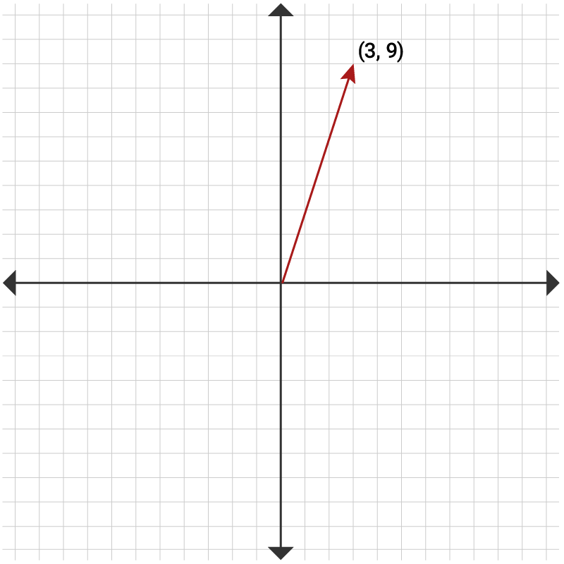
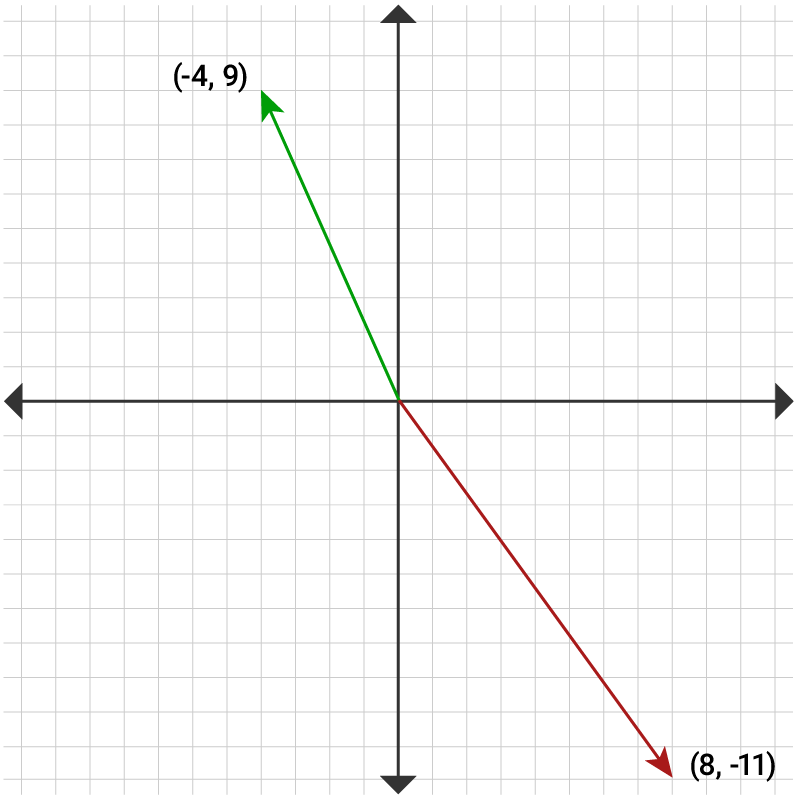
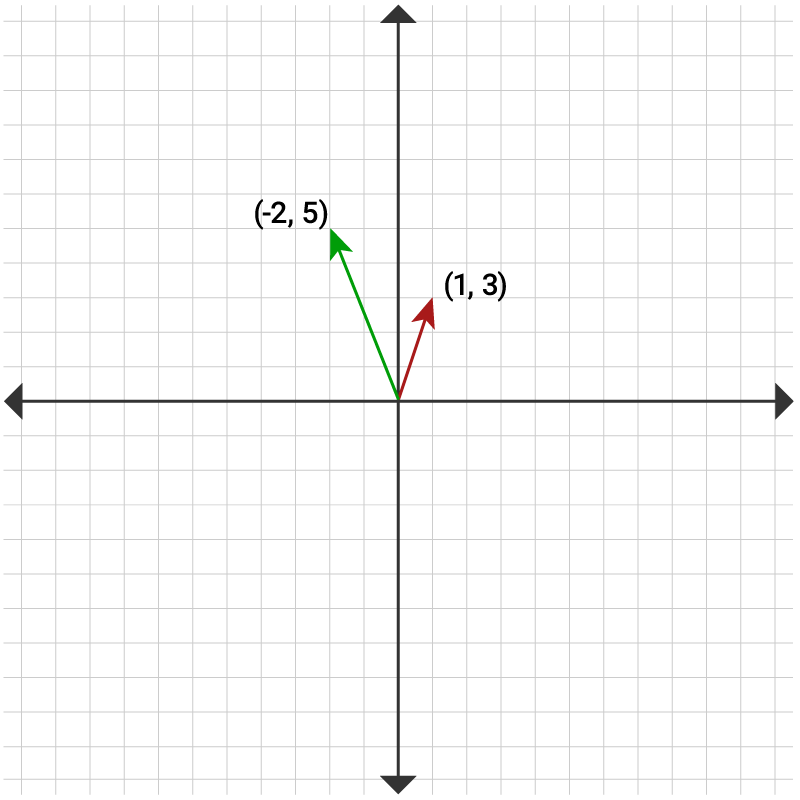

0x09. C# - Linear Algebra
=========================
Resources
---------

**Read or watch**:

*   [Essence of Linear Algebra Playlist](https://www.youtube.com/playlist?list=PLZHQObOWTQDPD3MizzM2xVFitgF8hE_ab "Essence of Linear Algebra Playlist")
*   [Immersive Math](http://immersivemath.com/ila/ch01_introduction/ch01.html "Immersive Math") (_Read chapters 1, 2, 3, 4, 6, 7_)
*   [The True Power of the Matrix (Transformations in Graphics) - Computerphile](https://www.youtube.com/watch?v=vQ60rFwh2ig "The True Power of the Matrix (Transformations in Graphics) - Computerphile")
*   [Math Class (System.Math)](https://docs.microsoft.com/en-us/dotnet/api/system.math?redirectedfrom=MSDN&view=netframework-4.7.2 "Math Class (System.Math)")
*   [Khan Academy - Linear Algebra](https://www.khanacademy.org/math/linear-algebra "Khan Academy - Linear Algebra")
*   [Linear Algebra in 4 Pages](https://minireference.com/static/tutorials/linear_algebra_in_4_pages.pdf "Linear Algebra in 4 Pages")
*   [GeoGebra 3D Graphing Calculator](https://www.geogebra.org/3d?lang=en "GeoGebra 3D Graphing Calculator") (_Useful for visualizing 3D vectors_)

### General

*   What is linear algebra
*   What is a radian
*   What is a vector
*   What is a vector space
*   What is a scalar
*   What is a linear transformation
*   What is a transformation matrix
*   What is transposing
*   What is linear independence and linear dependence
*   What is a dot product and how to calculate it
*   What is a cross product and how to calculate it
*   What is a standard basis
*   What is a matrix
*   What is the identity matrix
*   What is the zero matrix
*   What is a determinant and how to calculate it
*   What is the inverse of a matrix and how to calculate it

Requirements
------------

### .txt Answers

*   All your files should end with a new line
*   If the answer ends in a decimal, round it to the nearest hundredth
*   Vectors and matrices should be formatted with parentheses and commas as shown below:

Vector:

    (0, 0.03)
    

Matrix:

    (1, 0, -7.64)
    (-9.41, -0.23, 7)
    

### C# Projects

*   Allowed editors: `Visual Studio Code`
*   All files will be compiled on Ubuntu 14.04 LTS using `dotnet`
*   A `README.md` file, at the root of the folder of the project, is mandatory
*   All default C# files named `Program.cs` should be renamed to the name given in each task
*   Each C# task requires its own folder and `.csproj` file. Push all task folders to your Github and ensure the task names on the folders are correct
*   You do not need to push your `obj/` or `bin/` folders
*   In the following tasks, there are no `main` files. For each C# task, you can use the variables in the related task prior to it to create your own main files for testing
*   All your public classes and their members should have XML documentation tags
*   All your private classes and members should be documented but without XML documentation tags
*   You are not allowed to use the `Vector` or `Matrix` classes in this project
*   You can use the `Math` class in this project
*   If the task’s return value can end in a decimal, round it to the nearest hundredth

More Info
---------

This project uses [radians](https://en.wikipedia.org/wiki/Radian "radians") instead of degrees

* * *

Quiz questions
--------------

#### Question #0

In linear algebra, a vector is defined by:

- [X]   magnitude and direction
    
- [ ]   speed and direction
    
- [ ]   position and magnitude
    

#### Question #1

A vector has a specific starting position.

- [ ]   True
    
- [X]   False
    

#### Question #2

A scalar is:

- [ ]   a quarternion
    
- [ ]   a weighted average
    
- [X]   a real number
    

#### Question #3

Dot product is:

- [ ]   the result of multiplying two vectors together
    
- [X]   a scalar representation of two vectors
    
- [ ]   a vector’s position
    

#### Question #4

What does it mean if the dot product of two vectors is 0?

- [X]   the vectors are perpendicular
    
- [ ]   the dot product is unable to be calculated
    
- [ ]   the vectors are parallel
    

#### Question #5

Cross product is:

- [X]   the result of multiplying two vectors together
    
- [ ]   two vectors that intersect each other
    
- [X]   a vector that is perpendicular to two given vectors
    

#### Question #6

What does it mean if the cross product of two vectors is 0?

- [ ]   the vectors are parallel
    
- [X]   one or both of the vectors is a zero vector
    
- [ ]   the cross product is unable to be calculated
    

#### Question #7

Which of the following is an identity matrix?

- [ ] 

=

    1 1 1
    1 1 1
    1 1 1
      
- [ ]

=

    0 0 0
    0 1 0
    0 0 0
        
    
- [X]   

=

    1 0 0
    0 1 0
    0 0 1
        
    

#### Question #8

Which of the following is a zero matrix?

- [ ]   

=

    0 1 1
    1 0 1
    1 1 0
        
    
- [X]   

=

    0 0 0
    0 0 0
    0 0 0
        
    
- [X]   

=

    0 0
    0 0
        
    

#### Question #9

To transpose a matrix means to:

- [ ]   round the values in a matrix to whole numbers
    
- [ ]   calculate the sum of the diagonal of the matrix
    
- [X]   switch the rows and columns of the matrix
    

#### Question #10

A determinant is:

- [X]   a number calculated from the elements of a square matrix
    
- [ ]   a value determining whether a matrix is square or not
    
- [ ]   the number of elements in a matrix
    
#### Students who are done with "0. Pythagoras"

#### 0\. Pythagoras mandatory

Calculate the value of the following and write your answer in a text file:

Given the triangle `ABC` where `AB` = `64` and `BC` = `121`, what is the length of `AC`?

**Repo:**

*   GitHub repository: `holbertonschool-csharp`
*   Directory: `0x09-csharp-linear_algebra`
*   File: `0-pythagoras`

#### Students who are done with "1. Magnitude #0 - 2D"

#### 1\. Magnitude #0 - 2D mandatory

Calculate the value of the following and write your answer in a text file:

What is the length of vector **v**, assuming its origin is `0`, `0`?

**v** = `(3, 9)`

**Repo:**

*   GitHub repository: `holbertonschool-csharp`
*   Directory: `0x09-csharp-linear_algebra`
*   File: `1-magnitude_2D`

#### Students who are done with "2. Magnitude #1 - 3D"

#### 2\. Magnitude #1 - 3D mandatory

Calculate the value of the following and write your answer in a text file:

What is the length of **v**, assuming its origin is `0`, `0`, `0`?

**v** = `(7, -3, -9)`

**Repo:**

*   GitHub repository: `holbertonschool-csharp`
*   Directory: `0x09-csharp-linear_algebra`
*   File: `2-magnitude_3D`

#### Students who are done with "3. Magnitude #2"

#### 3\. Magnitude #2 mandatory

Create a method that calculates and returns the length of a given vector.

*   Class: `VectorMath`
*   Prototype: `public static double Magnitude(double[] vector)`
*   The vector can be 2D or 3D
*   If the vector is not a 2D or 3D vector, return `-1`
*   The return value should be rounded to the nearest tenth

**Repo:**

*   GitHub repository: `holbertonschool-csharp`
*   Directory: `0x09-csharp-linear_algebra`
*   File: `3-magnitude/, 3-magnitude/3-magnitude.csproj, 3-magnitude/3-magnitude.cs`

#### Students who are done with "4. Vector addition #0 - 2D"

#### 4\. Vector addition #0 - 2D mandatory

Calculate the value of the following and write your answer in a text file:

What is the sum of the 2D vectors **v** and **u**?

**v** = `(8, -11)`

**u** = `(-4, 9)`

**Repo:**

*   GitHub repository: `holbertonschool-csharp`
*   Directory: `0x09-csharp-linear_algebra`
*   File: `4-vector_addition_2D`

#### Students who are done with "5. Vector addition #1 - 3D"

#### 5\. Vector addition #1 - 3D mandatory

Calculate the value of the following and write your answer in a text file:

What is the sum of the 3D vectors **v** and **u**?

**v** = `(14, -2, 0)`

**u** = `(-3, 23, 50)`

**Repo:**

*   GitHub repository: `holbertonschool-csharp`
*   Directory: `0x09-csharp-linear_algebra`
*   File: `5-vector_addition_3D`

#### Students who are done with "6. Vector addition #2"

#### 6\. Vector addition #2 mandatory

Create a method that adds two vectors and returns the resulting vector.

*   Class: `VectorMath`
*   Prototype: `public static double[] Add(double[] vector1, double[] vector2)`
*   The vectors can be 2D or 3D
*   If any vector is not a 2D or 3D vector, or if the vectors are not of the same size, return a vector containing `-1`

**Repo:**

*   GitHub repository: `holbertonschool-csharp`
*   Directory: `0x09-csharp-linear_algebra`
*   File: `6-vector_addition/, 6-vector_addition/6-vector_addition.csproj, 6-vector_addition/6-vector_addition.cs`

#### Students who are done with "7. Vector-scalar multiplication #0 - 2D"

#### 7\. Vector-scalar multiplication #0 - 2D mandatory

Calculate the value of the following and write your answer in a text file:

What is the result of multiplying the 2D vector **v** and scalar _x_?

**v** = `(98, 972)`

_x_ = `0.5`

**Repo:**

*   GitHub repository: `holbertonschool-csharp`
*   Directory: `0x09-csharp-linear_algebra`
*   File: `7-vector_scalar_mul_2D`

#### Students who are done with "8. Vector-scalar multiplication #1 - 3D"

#### 8\. Vector-scalar multiplication #1 - 3D mandatory

Calculate the value of the following and write your answer in a text file:

What is the result of multiplying the 3D vector **v** and scalar _x_?

**v** = `(0, -16, 31)`

_x_ = `4`

**Repo:**

*   GitHub repository: `holbertonschool-csharp`
*   Directory: `0x09-csharp-linear_algebra`
*   File: `8-vector_scalar_mul_3D`

#### Students who are done with "9. Vector-scalar multiplication #2"

#### 9\. Vector-scalar multiplication #2 mandatory

Create a method that multiplies a vector and a scalar and returns the resulting vector.

*   Class: `VectorMath`
*   Prototype: `public static double[] Multiply(double[] vector, double scalar)`
*   The vectors can be 2D or 3D
*   If any vector is not a 2D or 3D vector, return a vector containing `-1`

**Repo:**

*   GitHub repository: `holbertonschool-csharp`
*   Directory: `0x09-csharp-linear_algebra`
*   File: `9-vector_scalar_mul/, 9-vector_scalar_mul/9-vector_scalar_mul.csproj, 9-vector_scalar_mul/9-vector_scalar_mul.cs`

#### Students who are done with "10. Dot product #0 - 2D"

#### 10\. Dot product #0 - 2D mandatory

Calculate the value of the following and write your answer in a text file:

What is the dot product of **v** and **u**?

**v** = `(1, 3)`

**u** = `(-2, 5)`

**Repo:**

*   GitHub repository: `holbertonschool-csharp`
*   Directory: `0x09-csharp-linear_algebra`
*   File: `10-dot_product_2D`

#### Students who are done with "11. Dot product #1 - 3D"

#### 11\. Dot product #1 - 3D mandatory

Calculate the value of the following and write your answer in a text file:

What is the dot product of **v** and **u**?

**v** = `(-4, 0, 10)`

**u** = `(3, 7, -9)`

**Repo:**

*   GitHub repository: `holbertonschool-csharp`
*   Directory: `0x09-csharp-linear_algebra`
*   File: `11-dot_product_3D`

#### Students who are done with "12. Dot product #2"

#### 12\. Dot product #2 mandatory

Create a method that calculates dot product of either two 2D or two 3D vectors.

*   Class: `VectorMath`
*   Prototype: `public static double DotProduct(double[] vector1, double[] vector2)`
*   The vectors can be either both 2D or both 3D
*   If any vector is not a 2D or 3D vector, or both vectors are not the same size, return `-1`

**Repo:**

*   GitHub repository: `holbertonschool-csharp`
*   Directory: `0x09-csharp-linear_algebra`
*   File: `12-dot_product/, 12-dot_product/12-dot_product.csproj, 12-dot_product/12-dot_product.cs`

#### Students who are done with "13. Matrix addition #0"

#### 13\. Matrix addition #0 mandatory

Calculate the value of the following and write your answer in a text file:

What is the result of adding the two matrices **M** and **N**?

**M** =

    (14, -3, 0)
    (-11, -5, 3)
    (2, -9, 13)
    

**N** =

    (6, 16, 21)
    (5, 2, 0)
    (1, 3, 7)
    

**Repo:**

*   GitHub repository: `holbertonschool-csharp`
*   Directory: `0x09-csharp-linear_algebra`
*   File: `13-matrix_addition`

#### Students who are done with "14. Matrix addition #1"

#### 14\. Matrix addition #1 mandatory

Create a method that adds two matrices and returns the resulting matrix.

*   Class: `MatrixMath`
*   Prototype: `public static double[,] Add(double[,] matrix1, double[,] matrix2)`
*   The matrices can be either both 2D or both 3D
    *   2D ex.: `double[,] matrix = { { 1, 2 }, { 3, 4 } };`
    *   3D ex.: `double[,] matrix = { { 1, 2, 3 }, { 4, 5, 6 }, { 7, 8, 9 } };`
*   If any matrix is not a 2D or 3D matrix, or both matrices are not the same size, return a matrix containing `-1`

**Repo:**

*   GitHub repository: `holbertonschool-csharp`
*   Directory: `0x09-csharp-linear_algebra`
*   File: `14-matrix_addition/, 14-matrix_addition/14-matrix_addition.csproj, 14-matrix_addition/14-matrix_addition.cs`

#### Students who are done with "15. Matrix-scalar multiplication #0"

#### 15\. Matrix-scalar multiplication #0 mandatory

Calculate the value of the following and write your answer in a text file:

What is the result of multiplying the matrix **M** and scalar _x_?

**M** =

    (-13, 10, 8)
    (2, 0, 14)
    (-4, -5, 2)
    

_x_ = `4`

**Repo:**

*   GitHub repository: `holbertonschool-csharp`
*   Directory: `0x09-csharp-linear_algebra`
*   File: `15-matrix_scalar_mul`

#### Students who are done with "16. Matrix-scalar multiplication #1"

#### 16\. Matrix-scalar multiplication #1 mandatory

Create a method that multiplies a matrix and a scalar and returns the resulting matrix.

*   Class: `MatrixMath`
*   Prototype: `public static double[,] MultiplyScalar(double[,] matrix, double scalar)`
*   The matrix can be either 2D or 3D
*   If the matrix is not a 2D or 3D matrix, return a matrix containing `-1`

**Repo:**

*   GitHub repository: `holbertonschool-csharp`
*   Directory: `0x09-csharp-linear_algebra`
*   File: `16-matrix_scalar_mul/, 16-matrix_scalar_mul/16-matrix_scalar_mul.csproj, 16-matrix_scalar_mul/16-matrix_scalar_mul.cs`

#### Students who are done with "17. Matrix-matrix multiplication #0"

#### 17\. Matrix-matrix multiplication #0 mandatory

Calculate the value of the following and write your answer in a text file:

What is the result of multiplying the two matrices **M** and **N**?

**M** =

    (2, 3)
    (-1, 0)
    

**N** =

    (1, 7)
    (-8, -2)
    

**Repo:**

*   GitHub repository: `holbertonschool-csharp`
*   Directory: `0x09-csharp-linear_algebra`
*   File: `17-matrix_matrix_mul`

#### Students who are done with "18. Matrix-matrix multiplication #1"

#### 18\. Matrix-matrix multiplication #1 mandatory

Create a method that multiplies two matrices and returns the resulting matrix.

*   Class: `MatrixMath`
*   Prototype: `public static double[,] Multiply(double[,] matrix1, double[,] matrix2)`
*   The matrices will not necessarily be square or the same dimensions
*   If the matrices cannot be multiplied, return a matrix containing `-1`

**Repo:**

*   GitHub repository: `holbertonschool-csharp`
*   Directory: `0x09-csharp-linear_algebra`
*   File: `18-matrix_matrix_mul/, 18-matrix_matrix_mul/18-matrix_matrix_mul.csproj, 18-matrix_matrix_mul/18-matrix_matrix_mul.cs`

#### Students who are done with "19. Matrix rotation #0"

#### 19\. Matrix rotation #0 mandatory

Calculate the value of the following and write your answer in a text file:

Rotate the matrix **M** by angle _θ_ (in radians). What is the resulting matrix?

**M** =

    (1, 2)
    (3, 4)
    

_θ_ = `-1.57`

**Repo:**

*   GitHub repository: `holbertonschool-csharp`
*   Directory: `0x09-csharp-linear_algebra`
*   File: `19-matrix_rotate_2D`

#### Students who are done with "20. Matrix rotation #1"

#### 20\. Matrix rotation #1 mandatory

Create a method that rotates a square 2D matrix by a given angle in radians and returns the resulting matrix.

**NOTE:** “Rotation” in this context means to apply rotation to the **value** of each element in the matrix, not changing the positions of the values in the matrix.

*   Class: `MatrixMath`
*   Prototype: `public static double[,] Rotate2D(double[,] matrix, double angle)`
*   If the matrix is of an invalid size, return a matrix containing `-1`

**Repo:**

*   GitHub repository: `holbertonschool-csharp`
*   Directory: `0x09-csharp-linear_algebra`
*   File: `20-matrix_rotate_2D/, 20-matrix_rotate_2D/20-matrix_rotate_2D.csproj, 20-matrix_rotate_2D/20-matrix_rotate_2D.cs`

#### Students who are done with "21. Matrix shear #0"

#### 21\. Matrix shear #0 mandatory

Calculate the value of the following and write your answer in a text file:

Shear the matrix **M** by the shear factor _s_ in the `X` direction. What is the resulting matrix?

**M** =

    (1, 2)
    (3, 4)
    

_s_ = `2`

**Repo:**

*   GitHub repository: `holbertonschool-csharp`
*   Directory: `0x09-csharp-linear_algebra`
*   File: `23-matrix_shear_2D`

#### Students who are done with "22. Matrix shear #1"

#### 22\. Matrix shear #1 mandatory

Create a method that shears a square 2D matrix by a given shear factor and returns the resulting matrix.

*   Class: `MatrixMath`
*   Prototype: `public static double[,] Shear2D(double[,] matrix, char direction, double factor)`
*   The shear factor can be in either the X or Y direction but not both
*   If the matrix is of an invalid size, return a matrix containing `-1`
*   If given an axis that is not `x` or `y`, return a matrix containing `-1`

**Repo:**

*   GitHub repository: `holbertonschool-csharp`
*   Directory: `0x09-csharp-linear_algebra`
*   File: `24-matrix_shear_2D/, 24-matrix_shear_2D/24-matrix_shear_2D.csproj, 24-matrix_shear_2D/24-matrix_shear_2D.cs`

#### Students who are done with "23. Transpose matrix"

#### 23\. Transpose matrix mandatory

Create a method to transpose a matrix and return the resulting matrix.

*   Class: `MatrixMath`
*   Prototype: `public static double[,] Transpose(double[,] matrix)`
*   The matrix can be of any dimension or size
*   If the matrix is empty, return an empty matrix

**Repo:**

*   GitHub repository: `holbertonschool-csharp`
*   Directory: `0x09-csharp-linear_algebra`
*   File: `25-matrix_transpose/, 25-matrix_transpose/25-matrix_transpose.csproj, 25-matrix_transpose/25-matrix_transpose.cs`

#### Students who are done with "24. Determinant #0"

#### 24\. Determinant #0 mandatory

Calculate the value of the following and write your answer in a text file:

What is the determinant of matrix **M**?

**M** =

    (2, 2)
    (-9, 4)
    

**Repo:**

*   GitHub repository: `holbertonschool-csharp`
*   Directory: `0x09-csharp-linear_algebra`
*   File: `26-determinant_2D`

#### Students who are done with "25. Determinant #1"

#### 25\. Determinant #1 mandatory

Calculate the value of the following and write your answer in a text file:

What is the determinant of matrix **M**?

**M** =

    (-4, 9, 0)
    (1, -2, 1)
    (3, -4, 2)
    

**Repo:**

*   GitHub repository: `holbertonschool-csharp`
*   Directory: `0x09-csharp-linear_algebra`
*   File: `27-determinant_3D`

#### Students who are done with "26. Determinant #3"

#### 26\. Determinant #3 mandatory

Create a method that calculates the determinant of a matrix.

*   Class: `MatrixMath`
*   Prototype: `public static double Determinant(double[,] matrix)`
*   If the matrix is not 2D or 3D, return `-1`

**Repo:**

*   GitHub repository: `holbertonschool-csharp`
*   Directory: `0x09-csharp-linear_algebra`
*   File: `28-determinant/, 28-determinant/28-determinant.csproj, 28-determinant/28-determinant.cs`

#### Students who are done with "27. Cross product #0"

#### 27\. Cross product #0 mandatory

Calculate the value of the following and write your answer in a text file:

What is the cross product of **v** and **u**?

**v** = `(2, -2, 1)`

**u** = `(-8, 8, -4)`

**Repo:**

*   GitHub repository: `holbertonschool-csharp`
*   Directory: `0x09-csharp-linear_algebra`
*   File: `29-cross_product`

#### Students who are done with "28. Cross product #1"

#### 28\. Cross product #1 mandatory

Create a method that calculates the cross product of two 3D vectors and returns the resulting vector.

*   Class: `VectorMath`
*   Prototype: `public static double[] CrossProduct(double[] vector1, double[] vector2)`
*   If either vector is not a 3D vector, return a vector containing `-1`

**Repo:**

*   GitHub repository: `holbertonschool-csharp`
*   Directory: `0x09-csharp-linear_algebra`
*   File: `30-cross_product/, 30-cross_product/30-cross_product.csproj, 30-cross_product/30-cross_product.cs`

#### Students who are done with "29. Inverse #0"

#### 29\. Inverse #0 mandatory

Calculate the value of the following and write your answer in a text file:

What is the inverse of **M**?

**M** =

    (1, 2)
    (3, 4)
    

**Repo:**

*   GitHub repository: `holbertonschool-csharp`
*   Directory: `0x09-csharp-linear_algebra`
*   File: `31-inverse_2D`

#### Students who are done with "30. Inverse #1"

#### 30\. Inverse #1 mandatory

Calculate the value of the following and write your answer in a text file:

What is the inverse of **M**? Round to the nearest tenth.

**M** =

    (11, 8, 7)
    (2, 13, 1)
    (4, 0, 17)
    

**Repo:**

*   GitHub repository: `holbertonschool-csharp`
*   Directory: `0x09-csharp-linear_algebra`
*   File: `32-inverse_3D`

#### Students who are done with "31. Inverse #2"

#### 31\. Inverse #2 mandatory

Create a method that calculates the inverse of a 2D matrix and returns the resulting matrix.

*   Class: `MatrixMath`
*   Prototype: `public static double[,] Inverse2D(double[,] matrix)`
*   If the matrix is not a 2D matrix, return `-1`
*   If the matrix is non-invertible, return `-1`

**Repo:**

*   GitHub repository: `holbertonschool-csharp`
*   Directory: `0x09-csharp-linear_algebra`
*   File: `33-inverse_2D/, 33-inverse_2D/33-inverse_2D.csproj, 33-inverse_2D/33-inverse_2D.cs`
